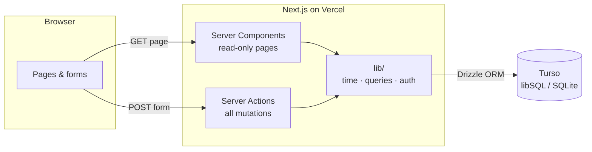
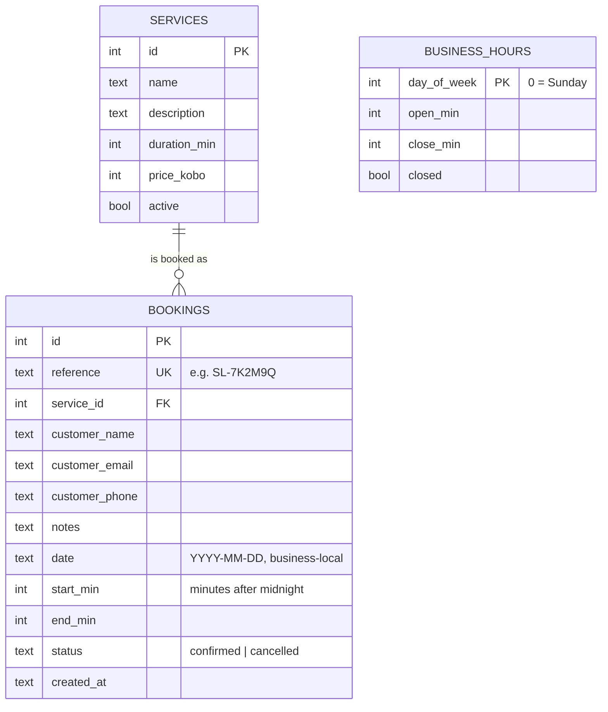
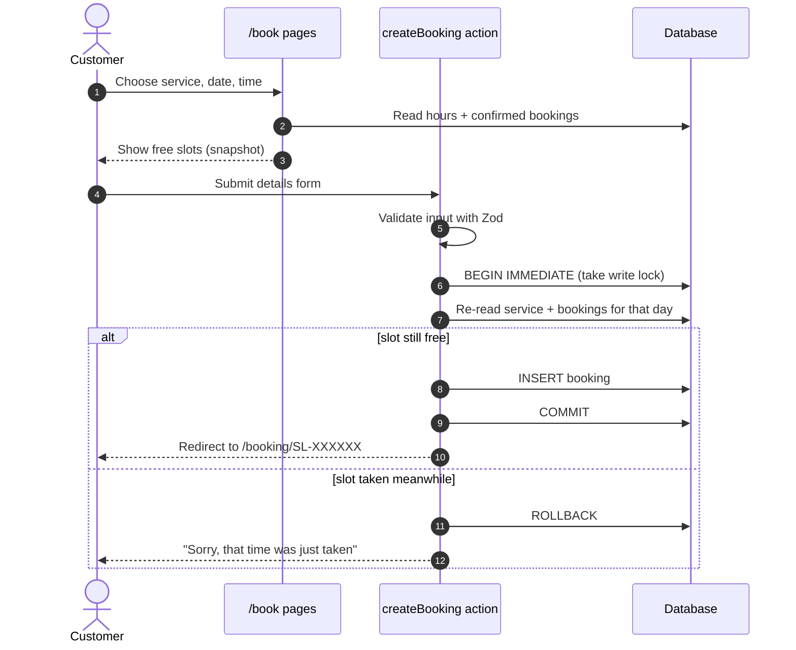
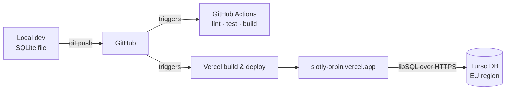

# Slotly — Design Document

This document explains **how Slotly works and why it's built the way it is**. For setup and usage, see the [README](README.md).

- **Status:** MVP, live at [slotly-orpin.vercel.app](https://slotly-orpin.vercel.app)
- **Author:** Charles Iduh

---

## 1. Problem and goals

Small service businesses in Nigeria (salons, barbers, nail studios, clinics) mostly take bookings over phone calls and WhatsApp. That means slow replies, double bookings, no record of who is coming, and no way for customers to book outside opening hours.

**Goals**

1. A customer can book an appointment in under a minute, on a phone, without creating an account.
2. The system **never double-books** a time slot, even when two people book at the same moment.
3. Staff can see the day's schedule at a glance and cancel or restore bookings.
4. Times are always correct for the business's location, wherever the server runs.
5. The core flows work without client-side JavaScript (progressive enhancement).

**Non-goals (for the MVP)**

- Multiple staff members or rooms running in parallel (one appointment at a time).
- Customer accounts, online payments, email/SMS notifications.
- Multi-business (multi-tenant) support.

These are deliberate scope cuts, and several are on the [roadmap](#12-future-work).

---

## 2. Architecture overview

Slotly is a single Next.js 16 application. Pages are **React Server Components** that read from the database directly, and every write goes through a **Server Action**. There is no separate REST API, because the app is its only client.



### Code layout

| Path | Responsibility |
| --- | --- |
| `src/app/` | Routes (pages) and `actions.ts` (all Server Actions) |
| `src/components/` | Reusable UI, including the client components for forms |
| `src/db/` | Drizzle schema and database client |
| `src/lib/time.ts` | **Pure** date/time and slot-generation logic, with no I/O |
| `src/lib/queries.ts` | Database reads, including availability |
| `src/lib/auth.ts` | Admin session handling |
| `src/lib/booking-rules.ts` | Business rules as named constants |
| `scripts/` | Seed data and screenshot automation |

**Why this split:** the logic most likely to have bugs (slot calculation, date maths) lives in `time.ts` with no database or framework dependencies, so it can be unit-tested in milliseconds. Anything touching the database is marked `server-only`, so it can never be accidentally bundled into browser code.

### Routes

| Route | Type | Purpose |
| --- | --- | --- |
| `/` | Dynamic | Landing page with services, hours and a live "next available" card |
| `/book` | Dynamic | Step 1 (choose service) and step 2 (date & time) |
| `/book/details` | Dynamic | Step 3: customer details form |
| `/booking` | Static | Look up a booking by reference |
| `/booking/[reference]` | Dynamic | Booking status, confirmation and self-service cancel |
| `/booking/[reference]/calendar` | Route handler | Downloadable `.ics` calendar file for a confirmed booking |
| `/admin/login` | Dynamic | Staff login |
| `/admin` | Dynamic, protected | Daily schedule and stats |
| `/admin/services` | Dynamic, protected | Add, hide and show services |

The booking flow keeps its state **in the URL** (`?service=4&date=2026-09-24&time=540`) rather than in client state. That makes every step linkable and shareable, lets the browser Back button work naturally, and needs no JavaScript.

---

## 3. Data model



### Key modelling decisions

**Times are stored as a local date plus minutes after midnight, not as timestamps.**
A booking at 2:30 PM on 24 September is stored as `date = "2026-09-24"`, `start_min = 870`.

- The business thinks in local wall-clock time ("we open at 9"), so the data matches how people reason about it.
- Overlap checks become simple integer comparisons.
- There is no chance of a server in another timezone (Vercel runs in the US by default) shifting a booking by an hour.
- The trade-off is that this only works cleanly for a single-timezone business. That's true for this product, and it's documented as a limitation.

**Money is stored as integer kobo** (`₦25,000` → `2500000`). Floating-point numbers can't represent many decimal values exactly, and integer arithmetic avoids a whole class of rounding bugs.

**`end_min` is stored even though it could be calculated** from the service duration. If a service's duration is later edited, existing bookings must keep the time they were booked for.

**Bookings are cancelled, never deleted.** The `status` column keeps history for the admin, lets a cancellation be undone, and would support reporting later. Services are likewise *hidden* (`active = false`) rather than deleted, so old bookings still point at a valid service.

**Index:** `bookings(date, status)`, because every availability check filters on exactly those two columns.

**Booking references** are `SL-` plus 6 characters from an alphabet that leaves out look-alikes (`0/O`, `1/I`), so they can be read over the phone. They're generated with `crypto.randomInt`, giving 32⁶ ≈ 1 billion combinations, and the database enforces uniqueness.

---

## 4. Availability algorithm

The heart of the system is `generateSlots()` in `src/lib/time.ts`.

**Inputs:** opening time, closing time, service duration, existing confirmed bookings for that day, slot step (30 min) and the earliest allowed start.

**Rule:** a start time `s` is offered if and only if

1. `s ≥ open` and `s + duration ≤ close`: the whole service fits inside opening hours, and
2. `s ≥ earliest`: for today, that's now plus 60 minutes' notice, and
3. `[s, s + duration)` overlaps no confirmed booking.

Two time ranges overlap when `a.start < b.end && b.start < a.end`. Ranges are **half-open**, so a booking ending at 10:00 doesn't block one starting at 10:00.

**Worked example:** a 90-minute Silk Press on a day open 09:00–18:00 with three existing bookings.

```
Open        09:00 ──────────────────────────────────────────────── 18:00
Booked      [09:00–09:45] [10:00–11:30] [12:00──────────16:00]

Candidate   Ends    Result
  09:00     10:30   ✗ overlaps 09:00–09:45
  09:30     11:00   ✗ overlaps 10:00–11:30
  10:00–11:00       ✗ overlap 10:00–11:30
  11:30     13:00   ✗ overlaps 12:00–16:00
  12:00–15:30       ✗ overlap 12:00–16:00
  16:00     17:30   ✓ starts exactly when 12:00–16:00 ends
  16:30     18:00   ✓ ends exactly at closing
  17:00     18:30   ✗ runs past closing
```

Result: `4:00 PM, 4:30 PM`. This exact case was run through `generateSlots` to confirm it. The short gaps (15 minutes at 09:45–10:00 and 30 minutes at 11:30–12:00) are correctly skipped, because a 90-minute service cannot fit in them.

Business rules live in `booking-rules.ts` as named constants rather than magic numbers:

| Constant | Value | Meaning |
| --- | --- | --- |
| `BOOKING_WINDOW_DAYS` | 21 | How far ahead customers can book |
| `LEAD_TIME_MIN` | 60 | Minimum notice for same-day bookings |
| `SLOT_STEP_MIN` | 30 | Granularity of offered start times |

**Complexity:** for a day with *n* candidate slots and *b* bookings, the check is O(n × b). With at most ~20 slots and a handful of bookings per day, that's trivially fast. An interval tree would be over-engineering.

**Whole-window availability.** The month calendar needs every day at once, so `getAvailability()` loads the opening hours and all confirmed bookings in the 21-day window with **two queries**, then runs `generateSlots` per day in memory, instead of two queries per day. "Next available" (the hero widget and the default date on `/book`) is simply the first day in that result with a free slot. The booking action still re-checks the single chosen day inside its transaction (section 5).

---

## 5. Booking flow and double-booking prevention

The page showing the slots is only a *snapshot*. Between a customer seeing "2:00 PM" and pressing **Confirm**, someone else could take it. Slotly therefore re-checks availability at write time, **inside a write transaction**:



**Why this is safe:** `BEGIN IMMEDIATE` takes SQLite's write lock at the *start* of the transaction, not at the first write. Two concurrent bookings are therefore **serialized**. The second one waits, then re-reads and sees the first booking. Without this, both could read "free" and both insert (a classic check-then-act race).

The libSQL driver opens write transactions with `BEGIN IMMEDIATE` by default, both for local files and for Turso over HTTP. The `{ behavior: "immediate" }` option in `actions.ts` documents that intent.

**The same rule applies to admin "Restore".** Restoring a cancelled booking re-checks for overlaps first, because the slot may have been re-booked since the cancellation.

**Alternatives considered**

| Approach | Why not (for now) |
| --- | --- |
| Check in the app only, no transaction | Has the race described above |
| Unique constraint on `(date, start_min)` | Only catches identical start times, not overlapping ranges (09:00–10:30 vs 09:30–10:00) |
| Postgres exclusion constraint on a time range | The strongest option, and the natural choice if the project moves to Postgres. Not available in SQLite |

---

## 6. Time handling

- The business timezone is configurable (`NEXT_PUBLIC_BUSINESS_TZ`, default `Africa/Lagos`).
- "Now" is always computed **in the business timezone** using `Intl.DateTimeFormat`. The server's own clock zone is never used for business logic.
- Calendar arithmetic (`addDays`, `dayOfWeek`) is done on UTC midnight dates, which have no daylight-saving jumps, so "add one day" is always exactly one calendar day.
- Tests cover the edge cases that usually break date code: month and year rollovers, invalid dates like 30 February, and 23:30 UTC already being the next day in Lagos.

Lagos has no daylight saving time. A business in a DST timezone would need extra handling for the one day a year with a missing or repeated hour.

---

## 7. Security

| Concern | How it's handled |
| --- | --- |
| **Admin authentication** | A single admin password from an environment variable. On success the server sets an **`httpOnly`, `SameSite=Lax`, `Secure` (in production)** cookie containing an expiry time and an **HMAC-SHA256 signature**. It can't be read by JavaScript, forged without the secret or used after 12 hours. |
| **Timing attacks** | Password and signature checks use `crypto.timingSafeEqual`. The password is compared as HMACs so the comparison takes the same time regardless of length. |
| **Server Actions are public endpoints** | Any Server Action can be called with a direct POST request, not just from the UI. **Every admin action calls `requireAdmin()` itself**, and admin pages check too. Protection never relies on hiding a button. |
| **Input validation** | All form input is validated on the server with Zod (types, lengths, email and phone formats, real calendar dates). Client-side validation is only for convenience. |
| **SQL injection** | All queries go through Drizzle's parameterized query builder. No SQL is built from strings. |
| **XSS** | React escapes all rendered values. No `dangerouslySetInnerHTML` is used. |
| **Cancelling someone else's booking** | Knowing a reference isn't enough. The customer must also enter the email used to book, and the update matches on both. |
| **Privacy** | Booking pages are marked `noindex`. Customer emails are never put in URLs. The public booking page shows only the customer's name. |
| **Secrets** | `.env*` files are git-ignored. Production secrets live only in Vercel's environment settings. |

**Known gaps:** there is no rate limiting on login or booking yet (see [limitations](#11-known-limitations)).

---

## 8. Rendering and data freshness

- Pages that depend on the request (search parameters, cookies) are rendered per request automatically.
- The hero booking widget calls `connection()`, because its content depends on the current time and must never be served from a build-time snapshot.
- It is wrapped in `<Suspense>` with a calendar-shaped skeleton, so the rest of the home page streams immediately while availability loads.
- After a mutation, actions call `revalidatePath()` for affected pages (for example `/admin` after a booking), so staff see changes straight away.

### Feedback, errors and metadata

- **Action feedback.** Server Actions that redirect add `?notice=<key>`. The page validates the key against a fixed list (`lib/notices.ts`), and a small client component shows the message, then removes the parameter with `history.replaceState` so a refresh doesn't repeat it. Unknown keys are ignored, so the URL can't inject arbitrary text.
- **Errors.** `not-found.tsx` handles unknown pages and booking references. `error.tsx` catches unexpected failures with a "Try again" button (using this Next.js version's `retry()`), and `global-error.tsx` is a self-contained last resort if the root layout itself fails.
- **Metadata.** Every page has its own title and description (booking pages include the service name and price). Private pages (admin, booking pages, the details step) are `noindex`. `icon.svg`, `apple-icon.tsx` and `opengraph-image.tsx` generate the favicon, iOS home-screen icon and social share card.

---

## 9. Testing and quality

| Layer | Tooling | What it covers |
| --- | --- | --- |
| Unit | Node's built-in test runner | Slot generation, overlap rules, date arithmetic, timezone conversion (including local-to-UTC for calendar files), formatting (15 tests) |
| Types | TypeScript strict mode + Next.js generated route types | Page props and route params checked at compile time |
| Lint | ESLint (Next.js config) | Common React and Next.js mistakes |
| CI | GitHub Actions | Every push to `main`: install → lint → test → create DB → seed → production build |
| Manual / visual | Playwright screenshot script | Desktop, mobile and dark-mode rendering of every key page |
| Site audit | `scripts/audit.ts` (Playwright) | Crawls every page at 375px and 1280px: broken links, horizontal overflow, missing titles and descriptions, heading structure, tap targets under 24px, inputs under 16px (iOS zoom), console errors |

**Why Node's test runner instead of Jest or Vitest:** the logic under test is plain TypeScript with no DOM, so a zero-dependency runner is enough and keeps CI fast. End-to-end tests with Playwright are the next planned addition.

---

## 10. Deployment



- **Same code, different database URL.** Locally `DATABASE_URL=file:local.db`, in production a `libsql://` Turso URL. Drizzle and the libSQL client handle both, so there is no separate code path.
- **Why Turso/SQLite rather than Postgres:** zero-setup local development (a file), a generous free tier, and SQLite's simplicity suit a single-business app. The schema uses nothing SQLite-specific that couldn't be moved to Postgres with Drizzle if needed.
- **Database region:** Turso runs in AWS `eu-west-1` (Ireland), the closest low-latency region to Nigeria in the free tier.
- **Schema changes** are applied with `drizzle-kit push`. That suits the MVP, but versioned migrations (`drizzle-kit generate`) should replace it before there is real customer data to protect.

---

## 11. Known limitations

Being explicit about these is part of the design:

1. **One appointment at a time.** The business is modelled as a single chair or resource. Two staff members couldn't each take a 10:00 booking.
2. **No rate limiting.** The login form could be brute-forced and the booking form could be spammed. Mitigation: per-IP rate limiting (for example Upstash Redis) plus a strong admin password.
3. **Single shared admin password.** There are no individual staff accounts or audit trail of who cancelled what.
4. **Opening hours are seed data.** Staff can't yet edit hours or add holidays from the dashboard.
5. **No notifications.** Customers don't get a confirmation email or reminder.
6. **Schema managed with `push`, not migrations** (see §10).
7. **Single timezone, no DST handling** (see §6).

---

## 12. Future work

Roughly in priority order:

1. **Paystack deposits.** A paid deposit secures the slot and reduces no-shows. It would need a `pending_payment` booking status that holds the slot for a few minutes, plus a verified webhook to confirm payment.
2. **Email confirmations and reminders** via Resend, with a cancel link in the email.
3. **Multiple staff.** Add a `staff` table and a `staff_id` on bookings. Availability becomes "at least one qualified staff member is free", and the overlap check is scoped per staff member.
4. **Rate limiting** on login and booking.
5. **Admin editing of opening hours and holidays.**
6. **Playwright end-to-end tests** in CI, including a test that fires two simultaneous bookings for the same slot.
7. **Versioned database migrations.**

---

## 13. Visual design system

The visual source of truth is **[docs/design-spec.md](docs/design-spec.md)**, a design-system analysis of Cal.com's interface (tokens, typography, components and responsive rules). Slotly adopts it because a booking product should look like professional scheduling software: calm, monochrome and focused on the calendar, with brand character coming from typography and real product UI rather than colour.

Every value below comes from that spec unless it's listed under deviations.

### Tokens

Tokens live once in `src/app/globals.css` as CSS variables, exposed to Tailwind through `@theme`. Components only use semantic names, never raw hex values.

| Token | Light | Dark | Used for |
| --- | --- | --- | --- |
| `canvas` | `#ffffff` | `#0a0a0a` | Page background |
| `surface-soft` | `#f8f9fa` | `#111111` | Alternating bands, pill-group background |
| `surface-card` | `#f5f5f5` | `#171717` | Feature and testimonial cards, available calendar days |
| `hairline` | `#e5e7eb` | `#262626` | Borders, dividers, inputs |
| `ink` | `#111111` | `#fafafa` | Headings and primary text |
| `body` | `#374151` | `#d4d4d8` | Running text |
| `muted` | `#6b7280` | `#a1a1aa` | Secondary text on white |
| `primary` | `#111111` | `#ffffff` | Primary buttons, selected calendar day |
| `surface-dark` | `#101010` | `#000000` | Footer, the only dark surface |
| `success` / `error` | `#10b981` / `#ef4444` | same | Icons, borders and tinted backgrounds |
| Badge pastels | orange, pink, violet, emerald | same | Avatar fills and confetti only, never on buttons |

**Radius:** 8px for buttons and inputs, 12px for cards, 16px for the booking widget, pills for badges and tab groups, circles for avatars and icon buttons. **Shadows:** only `0 1px 2px` (active tab) and `0 4px 12px` (booking widget). **Spacing:** 4px base unit, 96px between sections (64px on phones), 32px or 24px inside cards, 1200px maximum width.

### Typography

- **Cal Sans** for display headings, loaded through `next/font`. Cal.com has since published it on Google Fonts, so the substitute the spec suggests isn't needed. It ships as one weight that's already drawn as the display weight, so `font-synthesis: none` stops the browser faking a heavier version.
- **Inter** for everything else: body, buttons, navigation, captions and forms.

Utilities mirror the spec's scale: `display-xl` (64px, -2px tracking) down to `display-sm` (28px), then `title-lg/md/sm`, `body-md/sm` and `caption`. The hero headline steps from 64px to 32px on phones.

### Components

| Utility / component | Spec component | Notes |
| --- | --- | --- |
| `btn-primary`, `btn-secondary` | button-primary / secondary | 40px tall, 8px radius, 14px/600 label. Only the pressed state changes the look |
| `icon-btn` | button-icon-circular | 36px circle: theme toggle, menu, date arrows |
| `input` | text-input | 40px, hairline border that turns ink on focus |
| `badge` | badge-pill | Durations, status, section labels |
| `pill-group`, `pill-tab(-active)` | nav-pill-group, category-tab | "How it works" step switcher and admin tabs |
| `feature-card` | feature-card | Grey service cards on the home page |
| `outline-card` | feature-icon / product-mockup card | Service picker, forms, hours and contact |
| `mockup-card` | hero-app-mockup-card | The booking widget, confirmation card and hero booker |
| `MonthCalendar` | product UI shown in-card | Available days on grey tiles, selected day solid, today dotted, unavailable days faint |
| Footer | footer | 4 columns → 2 → 1, on-dark-soft links |

**Page pacing** alternates surfaces as the spec prescribes: white hero with the live booking widget, white band with grey feature cards, light-grey band with the white product mockup, white band with grey testimonials, light-grey band with white cards, a light CTA band and the dark footer.

### Deviations from the spec (and why)

- **Semantic text colours.** The spec's `success` and `error` are below 4.5:1 as text on white, so they're used for icons, borders and tints, and text uses darker variants (`success-text` `#047857`, `error-text` `#b91c1c`).
- **Secondary text on grey cards.** `muted` on `surface-card` measures 4.43:1, just under AA, so text on grey cards uses `body` (9.45:1).
- **Faint grey.** `muted-soft` (`#898989`, 3.5:1) is used only for unavailable calendar days (disabled controls are exempt under WCAG 1.4.3) and on the dark footer (5.4:1). Placeholders use `muted`.
- **Dark mode.** The spec is light-only. Slotly keeps an optional dark theme built from the spec's own dark surface tokens, with the primary colour inverted to white.
- **Avatar initials** are `#111111` rather than white, because white fails contrast on the pastel fills.

### Themes

A tiny inline script in `<head>` sets `data-theme` before the first paint, from the saved choice or else the OS preference, so there's no flash. The server renders a default, and `suppressHydrationWarning` lets the script's change stand. Switching theme only swaps the CSS variables.

### Motion

The spec leaves animation out of scope and rules out hover effects, so motion is limited to small, purposeful moments:

| Where | Technique | Why |
| --- | --- | --- |
| Hero entrance, time slots, page transitions | CSS keyframes (`animate-word`, `animate-rise`, `template.tsx`) | Runs from the first paint without JavaScript, so nothing is blank on slow mobile connections |
| Section reveals | Motion + `useInView` | Content is visible in the server HTML; only sections still off-screen after hydration are hidden, then revealed |
| Calendar selection | Optimistic state | The tapped day turns solid immediately while the server renders its times |
| "How it works" | `AnimatePresence` | Auto-advances only while on screen; pauses on hover and focus |
| Confirmation | `canvas-confetti` | One burst in the spec's pastels, skipped for reduced motion |

**Reduced motion:** `MotionConfig reducedMotion="user"` covers every Motion animation, and a `prefers-reduced-motion` media query neutralises CSS animations and transitions.

### Interaction and accessibility

- **Responsive.** Hamburger menu below 768px, opening a full-screen sheet anchored under the header. Grids collapse 3 → 2 → 1, and the three-pane booking widget stacks on phones.
- **Keyboard.** A "Skip to content" link, a visible 2px focus outline on every control (in the base CSS layer, so components such as inputs can refine it), and native `<form>`, `<button>` and `<details>` elements.
- **Screen readers.** The calendar is a labelled grid ("Friday 25 September, available"), form errors are linked with `aria-describedby`, messages use `role="alert"` and `role="status"`, tabs use `role="tab"` with `aria-selected`, and loading skeletons set `aria-busy`.
- **Touch.** Buttons and inputs are 40px tall, text links have 40px tap areas, and inputs use 16px text so iOS doesn't zoom on focus.
