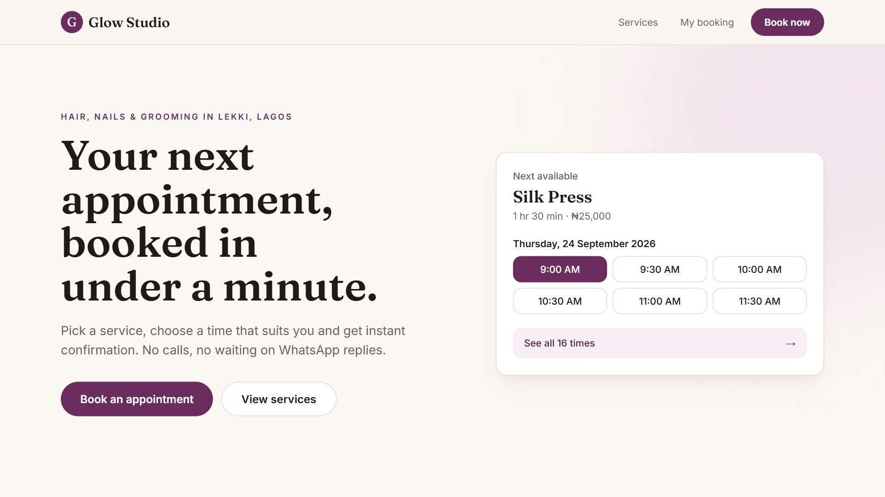
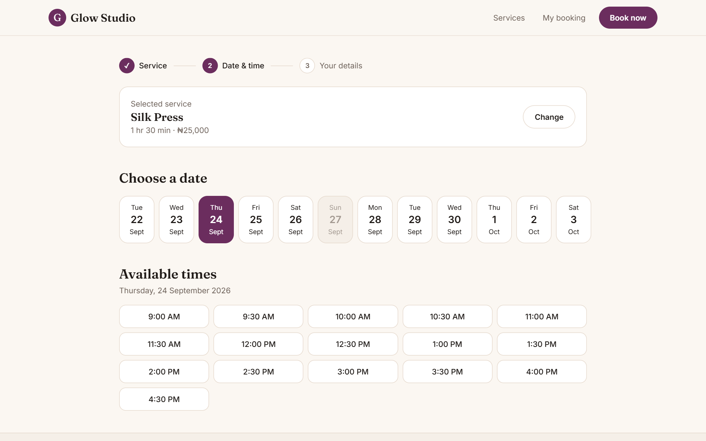
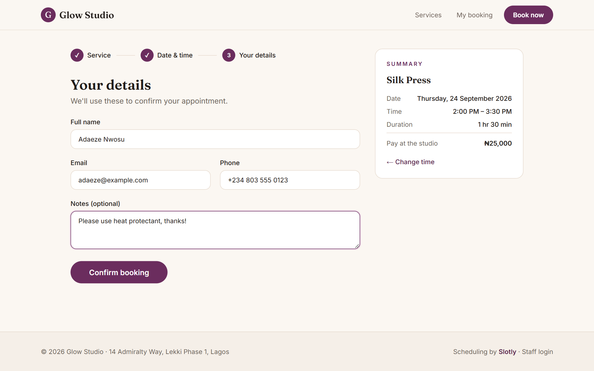
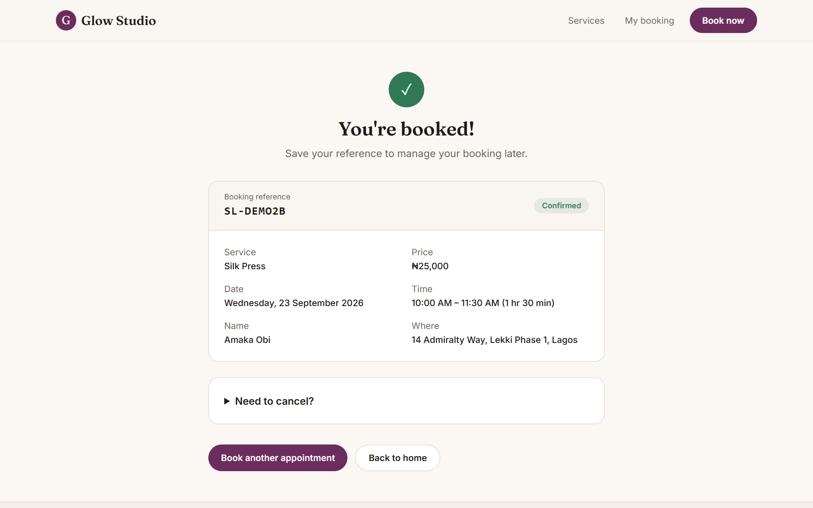
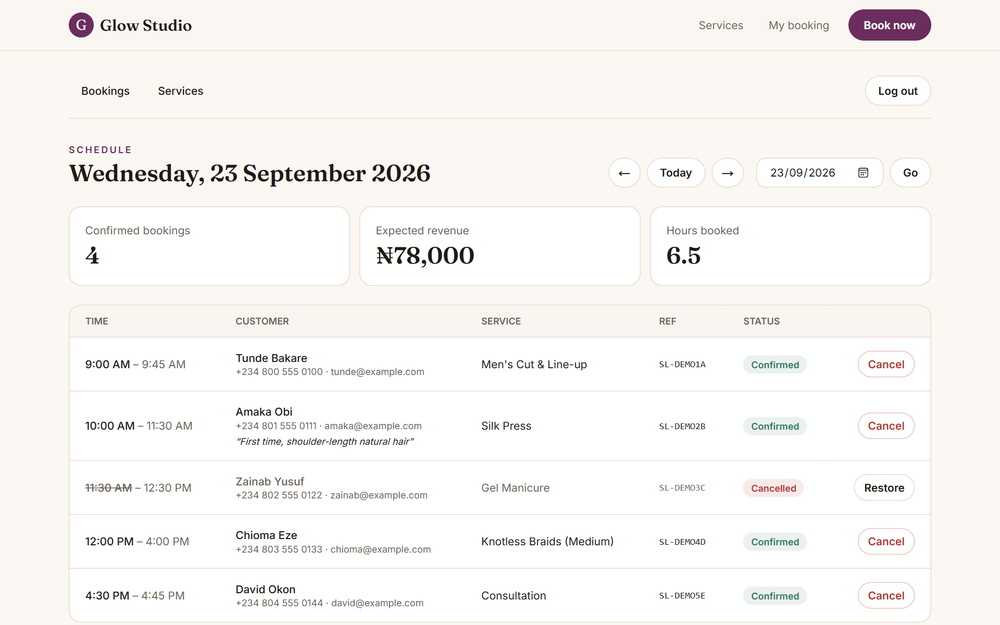
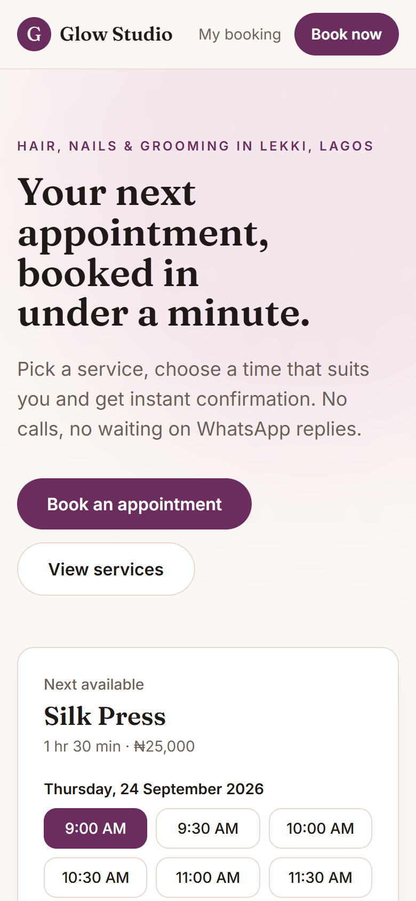
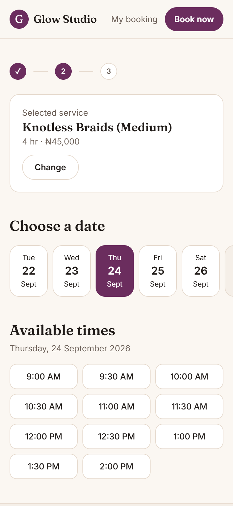
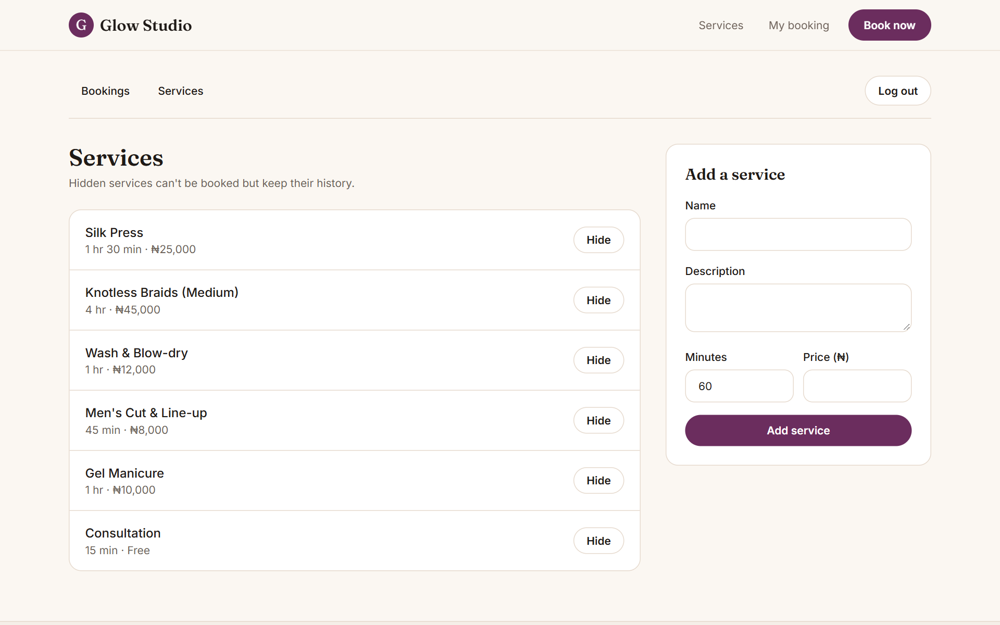

# Slotly

Online appointment booking for salons, barbers and clinics. Customers pick a service, see only genuinely free time slots and get an instant booking reference. Staff manage the day's schedule and services from a password-protected dashboard.

The demo is set up for **Glow Studio**, a fictional salon in Lagos.

> **Live demo: [slotly-orpin.vercel.app](https://slotly-orpin.vercel.app)** — try booking an appointment.

[](https://github.com/charlesiduh001-alt/slotly/actions/workflows/ci.yml)



## Screenshots

**Booking flow:** pick a time, enter details, get a reference

| Choose a time | Your details |
| --- | --- |
|  |  |

| Confirmation | Staff dashboard |
| --- | --- |
|  |  |

**On mobile**

<p>
  
  &nbsp;&nbsp;
  
</p>

<details>
<summary>Admin: managing services</summary>



</details>

## Features

**Customers**
- Browse services with prices and durations
- 3-step booking flow: service → date & time → details
- Live availability that accounts for service length, opening hours, existing bookings and same-day notice
- Booking reference page; self-service cancellation (requires the booking email)
- Mobile-first, keyboard-accessible, works without JavaScript for core flows

**Staff (`/admin`)**
- Day-by-day schedule with expected revenue and hours booked
- Cancel or restore bookings (restores can't create a double-booking)
- Add services and hide or show them

## Tech stack

| Area | Choice |
| --- | --- |
| Framework | Next.js 16 (App Router, Server Components, Server Actions) |
| Language | TypeScript |
| Styling | Tailwind CSS v4 |
| Database | SQLite locally / Turso in production, via Drizzle ORM |
| Validation | Zod |
| Tests | Node's built-in test runner |

## Engineering decisions

- **No double-bookings.** Availability is re-checked inside an `IMMEDIATE` SQLite transaction before the insert, so two customers submitting the same slot at once can't both succeed.
- **Timezone-safe times.** Bookings are stored as a local business date plus minutes after midnight, and "now" is always calculated in the business timezone (`Africa/Lagos`). Results don't depend on where the server runs.
- **Money as integers.** Prices are stored in kobo to avoid floating-point rounding errors.
- **Server-first.** Pages are Server Components and all mutations are Server Actions with Zod validation. Every admin action re-checks the session, because Server Actions can be called directly.
- **Simple, secure admin auth.** A signed, expiring, `httpOnly` cookie (HMAC-SHA256) with constant-time comparison. It's deliberately small, and can be swapped for Auth.js when staff accounts are added.
- **Pure, tested slot logic.** `generateSlots` in `src/lib/time.ts` has no I/O and is covered by unit tests.

## Getting started

```bash
npm install
cp .env.example .env.local   # then set ADMIN_PASSWORD and SESSION_SECRET
npm run db:push              # create tables
npm run db:seed              # demo services + opening hours
npm run dev
```

Open http://localhost:3000. The staff dashboard is at `/admin`.

### Scripts

| Command | What it does |
| --- | --- |
| `npm run dev` | Start the dev server |
| `npm test` | Run unit tests |
| `npm run typecheck` | TypeScript check |
| `npm run lint` | ESLint |
| `npm run build` | Production build |
| `npm run db:push` | Apply the schema to the database |
| `npm run db:seed` | Reset and seed demo data |
| `npm run db:studio` | Browse the database in Drizzle Studio |
| `npm run screenshots` | Regenerate README screenshots (needs `db:seed -- --with-bookings` and a running dev server) |

## Deployment (Vercel + Turso)

1. Create a Turso database and an auth token.
2. Put the credentials in `.env.production.local` (git-ignored):
   ```
   DATABASE_URL=libsql://<your-db>.turso.io
   DATABASE_AUTH_TOKEN=<token>
   ```
3. Create the tables and demo data: `npm run db:push:prod && npm run db:seed:prod`.
   The seed **wipes existing bookings**, so only run it on a fresh database.
4. Import the GitHub repo into Vercel and add the environment variables `DATABASE_URL`, `DATABASE_AUTH_TOKEN`, `ADMIN_PASSWORD` and `SESSION_SECRET`.

Every push to `main` runs lint, tests and a production build in GitHub Actions, and Vercel redeploys automatically.

## Project structure

```
src/
  app/            routes (booking flow, booking lookup, admin) + server actions
  components/     client components (forms, step indicator)
  db/             Drizzle schema and client
  lib/            time/slot logic, queries, auth, formatting
scripts/seed.ts   demo data
```

## Roadmap

- [ ] Email confirmations and reminders (Resend)
- [ ] Multiple staff members with individual calendars
- [ ] Online deposits with Paystack
- [ ] Admin editing of opening hours and holidays
- [ ] End-to-end tests with Playwright
- [x] Deploy to Vercel + Turso
